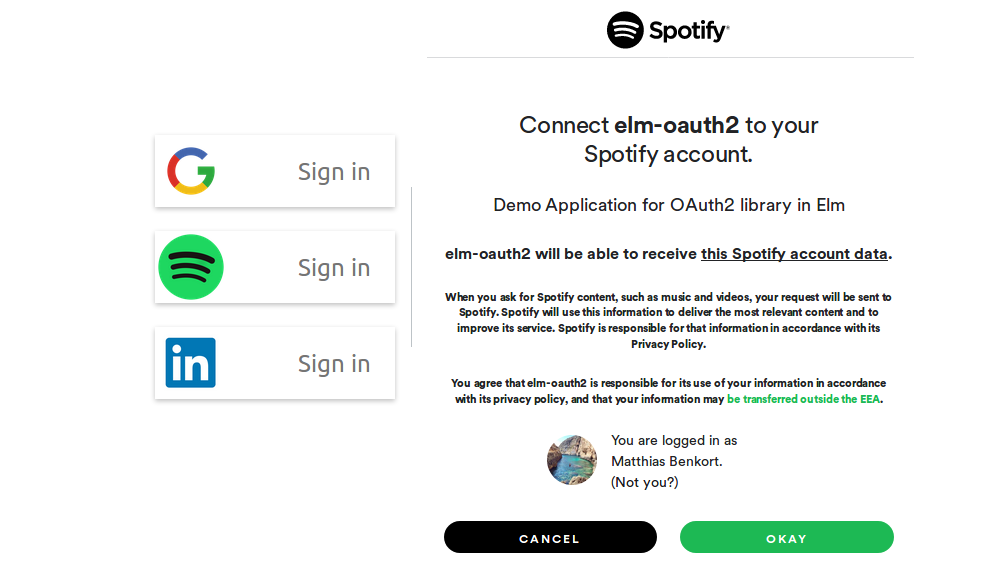

Elm OAuth 2 [](http://package.elm-lang.org/packages/truqu/elm-oauth2/latest) 
=====

This package offers some utilities to implement a client-side [OAuth 2](https://tools.ietf.org/html/rfc6749) authorization in Elm. 
It covers all 4 grant types: 

- [Implicit (Recommended)](http://package.elm-lang.org/packages/truqu/elm-oauth2/latest/OAuth-Implicit):
  The most commonly used. The token is obtained directly as a result of a user redirection to
  an OAuth provider. The implicit grant type is used to obtain access tokens (it does not
  support the issuance of refresh tokens) and is optimized **FOR PUBLIC CLIENTS**.

- [Authorization Code](http://package.elm-lang.org/packages/truqu/elm-oauth2/latest/OAuth-AuthorizationCode):
  The token is obtained as a result of an authentication, from a code obtained as a result of a
  user redirection to an OAuth provider. The authorization code grant type is used to obtain both access
   tokens and refresh tokens and is optimized **FOR CONFIDENTIAL CLIENTS** such as the device operating system 
   or a highly privileged application.

- [Resource Owner Password Credentials](http://package.elm-lang.org/packages/truqu/elm-oauth2/latest/OAuth-Password):
  The token is obtained directly by exchanging the user credentials with an OAuth provider. The resource owner password 
  credentials grant type is suitable in cases **WHERE THE RESOURCE OWNER HAS A TRUST RELATIONSHIP WITH THE CLIENT**.

- [Client Credentials](http://package.elm-lang.org/packages/truqu/elm-oauth2/latest/OAuth-ClientCredentials):
  The token is obtained directly by exchanging application credentials with an OAuth provider. The client credentials
  grant type **MUST ONLY BE USED BY CONFIDENTIAL CLIENTS**.

## Getting Started

### Installation

```
elm install truqu/elm-oauth2
```

### Usage

##### 1/ A model ready to receive a token and a message to convey the sign-in request

```elm
type alias Model =
    { redirectUri : Url
    , error : Maybe String
    , token : Maybe OAuth.Token
    , state : String
    }

type Msg = SignInRequested { clientId : String, authorizationEndpoint : String }
```

##### 2/ Init parses the token from the URL if any, and defines a model

```elm
init : { randomBytes : String } -> Url -> Key -> ( Model, Cmd Msg )
init { randomBytes } origin _ =
    let
        model =
            { redirectUri = { origin | query = Nothing, fragment = Nothing }
            , error = Nothing
            , token = Nothing
            , state = randomBytes
            }
    in
    case OAuth.parseToken origin of
        OAuth.Empty ->
            ( model, Cmd.none )

        OAuth.Success { token, state } ->
            if state /= Just model.state then
                ( { model | error = Just "'state' mismatch, request likely forged by an adversary!" }
                , Cmd.none
                )

            else
                ( { model | token = Just token }
                , getUserInfo config token
                )

        OAuth.Implicit.Error error ->
            ( { model | error = Just <| errorResponseToString error }
            , Cmd.none
            )
```

##### 3/ One replies to a sign-in request by redirecting the user to the authorization endpoint

```elm
update : Msg -> Model -> ( Model, Cmd Msg )
update msg model =
    case msg of
        SignInRequested { clientId, authorizationEndpoint } ->
            let
                auth =
                    { clientId = clientId
                    , redirectUri = model.redirectUri
                    , scope = []
                    , state = Just model.state 
                    , url = authorizationEndpoint
                    }
            in
            ( model
            , auth |> OAuth.Implicit.makeAuthUrl |> Url.toString |> Navigation.load
            )
```

### Demo 

Complete examples are available [here](https://github.com/truqu/elm-oauth2/tree/master/examples). 
Resulting applications can be seen on the following links:

- [implicit grant](https://truqu.github.io/elm-oauth2/examples/implicit/)
- [authorization-code](https://truqu.github.io/elm-oauth2/examples/authorization-code/)

[](https://truqu.github.io/elm-oauth2/examples/implicit/)


### TroubleShooting

##### Understanding OAuth roles

Throughout the library, you'll find terms referring to OAuth well-defined roles:

- **`resource owner`**  
  _An entity capable of granting access to a protected resource.
  When the resource owner is a person, it is referred to as an
  end-user._

- **`client`**  
  _An application making protected resource requests on behalf of the
  resource owner and with its authorization.  The term "client" does
  not imply any particular implementation characteristics (e.g.,
  whether the application executes on a server, a desktop, or other
  devices)._

- **`authorization server`**  
  _The server issuing access tokens to the client after successfully
  authenticating the resource owner and obtaining authorization._

- **`resource server`**  
  _The server hosting the protected resources, capable of accepting
  and responding to protected resource requests using access tokens._

> NOTE: Usually, the _authorization server_ and the _resource server_ are
> a same entity, or comes from the same entity. So, a simplified vision of
> this roles can be:
>
> - **`resource owner`**  
>   The end-user
> 
> - **`client`**  
>   Your Elm app
> 
> - **`authorization server`** / **`resource server`**  
>   Google, Facebook, Twitter or whatever OAuth provider you're talking to


##### Interacting with GitHub

GitHub API v3 supports the [Authorization Code Flow](https://developer.github.com/apps/building-oauth-apps/authorization-options-for-oauth-apps/#web-application-flow) 
in order to obtain access tokens for a registered application. However, the implementation 
presents a flaw which makes it not compliant with the official RFC:

- By default, GitHub's authorization server will respond with a `x-www-form-urlencoded` mime-type
  when trying to exchange the authorization code against an access token (instead of a
  `application/json` mime-type as specified in the official RFC).

- This behavior can be changed by providing an extra `Accept: application/json` header with the
  authenticate request. However, by doing so, GitHub's authorization server will encode the 
  `scope` of the response as a comma-separated list (instead of a space-separated list as
  specified in the official RFC).

Hence, this library provides a way to work around this implementation quirks by adjusting the 
authentication request before it gets sent. To achieve this, one may use the various decoders
now exposed in each module to craft a custom transformation function for the `authenticateWithOpts` functions.

Here's a small example of how to work around GitHub's API v3 implementation:

```elm
adjustRequest : Http.Request AuthenticationSuccess -> Http.Request AuthenticationSuccess
adjustRequest req =
    let
        headers =
            Http.header "Accept" ("application/json") :: req.headers

        expect =
            Http.expectJson AuthenticationSuccess <| Json.map4 
              defaultTokenDecoder
              defaultRefreshTokenDecoder
              defaultExpiresInDecoder
              lenientScopeDecoder
    in
        { req | headers = headers, expect = expect }


getToken : String -> Cmd AuthenticationSuccess
getToken code =
    let
        req =
          adjustRequest <| 
            OAuth.AuthorizationCode.makeTokenRequest AuthenticationSuccess <|
                OAuth.AuthorizationCode
                    { credentials = { clientId = clientId, secret = Nothing }
                    , code = code
                    , redirectUri = redirectUri
                    , scope = scope
                    , state = state
                    , url = tokenEndpoint
                    }
    in
        Http.send handleResponse (Http.request req)
```


##### Authentication rquests is the _Authorization Flow_ don't go through 

Most authorization servers don't enable CORS on the authentication endpoints. For this reason,
it's likely that the preflight _OPTIONS_ requests sent by the browser return an invalid
answer, preventing the browser from making the request at all. 

Why is it so? The authorization request _usually_requires one's secret; thus making them 
rather impractical to do perform from a client-side application without exposing those secrets.
As a security measure, most authorization servers choose to enforce that those requests are
made server-side. 

Generally, this is also what you want, unless you're dealing with a custom authorization server 
in some sort of isolated environment. OAuth 2.0 is a designed to cover all sort of delegation of
permissions, the case of user-facing client-side applications is only one of them; some 
authorization flows are therefore not necessarily adapted to these cases. Usually, a client-side
application will prefer the _Implicit Flow_ over the others.


## Changelog

[CHANGELOG.md](./CHANGELOG.md)
